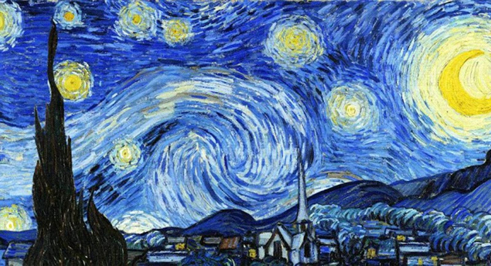

# Practice1.0
**_La noche estrellada_** 

Es uno de los cuadros más famosos de todos los tiempos.
*Vincent Van Gogh* decidió pintar un paisaje a partir de las vistas desde su ventana del asilo Saint-Paul-de-Mausole, donde fue internado debido a sus problemas mentales.  

**_"Esta mañana he visto el campo antes de amanecer desde mi ventana, con nada más que la estrella de la mañana, la cual era muy grande"._**

**Van Gogh**

